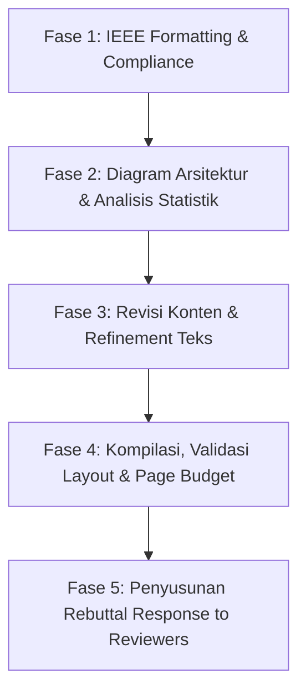

# Comprehensive Review Analysis, IEEE Template Comparison, and Step-by-Step Action Plan

**Document Purpose**: Rencana tindak lanjut revisi paper konferensi IEEE ITIS 2026 berdasarkan komentar reviewer dan analisis komparasi terhadap template resmi IEEE (`IEEE-conference-template-062824`).  
**Paper Target**: `newpaper/itis.tex`  
**Status**: Reviewer Feedback: Weak Accept (6), Accept (8), Accept (8) $\rightarrow$ Posisi sangat kuat menuju penerimaan final (Camera-Ready) dengan revisi minor–moderat terarah.

---

## 1. Analisis Feedback Reviewer & Pemilahan Scope (Feasible vs. Out-of-Scope)

Berdasarkan diskusi Anda dengan dosen pembimbing (Prof), prinsip utama revisi ini adalah:  
**"Hanya mengimplementasikan perbaikan yang feasible, bernilai tinggi, dan tidak memaksakan eksperimen baru yang berat atau di luar fokus paper (seperti benchmarking ulang terhadap cuDNN / atomicAdd)."**

Berikut adalah pemetaan komprehensif dari masukan ketiga reviewer:

| Reviewer | Poin Masukan / Kelemahan | Kategori Tindakan | Solusi & Justifikasi yang Diambil |
| :--- | :--- | :--- | :--- |
| **Rev 1 & 3** | Tidak menguji baseline GPU kompetitif (*atomicAdd* atau *cuDNN*) | **Out-of-Scope (Textual Clarification / Rebuttal)** | **Tidak perlu coding ulang.** Perkuat argumen metodologis di *Section III-B* dan *Section VII (Limitations)*: Paper ini bukan kompetisi kecepatan *raw brute-force* kernel, melainkan pembuktian pola arsitektural *race-free privatize-then-reduce* yang menjamin determinisme *bit-exact* by-construction tanpa *lock/atomic contention* ataupun ketergantungan pada *black-box opaque tensor layout* cuDNN. |
| **Rev 1 & 3** | Evaluasi terbatas pada 1 sekuens (Suzie) dan 1 skala ($2\times$) | **Out-of-Scope (Textual Clarification / Rebuttal)** | **Tidak perlu re-run dataset lain.** Sekuens Suzie 150-frame adalah *benchmark standard* dari literatur rujukan (Annisa et al., 2025). Jelaskan dalam *Section VII* bahwa Suzie cukup untuk membuktikan *cross-platform bit-exactness* dan pergeseran profil memori (L2 cache vs DRAM unified streaming). |
| **Rev 2** | Meminta pengujian FP32, FP16, BF16 untuk melihat trade-off akurasi vs speed | **Out-of-Scope (Analytic Discussion)** | Tidak perlu eksperimen FP16/BF16 baru. Jelaskan secara analitis bahwa tujuan utama penelitian adalah **strict bit-exactness** terhadap baseline CPU FP64. Penurunan ke FP32/FP16 secara inheren merusak determinisme *bit-exact* akibat non-asosiatif FP rounding, meskipun memberikan throughput lebih tinggi (sudah disinggung di *Section VI-D* dan akan dipertegas). |
| **Rev 2** | Belum ada uji signifikansi statistik (*statistical significance tests*) | **FEASIBLE (High Priority)** | **Sangat mudah diwujudkan.** Kita sudah memiliki data mentah 6 run valid (dari 7 run, 1 warmup dibuang) di `plans/raw_results.csv` dan `results_gpuprofile_*.csv`. Kita dapat menghitung *paired t-test* ($p$-value) dan *95% Confidence Intervals* untuk membuktikan signifikansi performa $32\times 8$ vs $16\times 16$ ($p < 0.001$). |
| **Rev 2** | Meminta diagram arsitektur (*architectural diagram: memory layout, kernel execution, reduction workflow*) | **FEASIBLE (High Priority)** | **Sangat bernilai tinggi.** Buat diagram visual alur memori: CPU Layers 1–7 $\rightarrow$ Buffer transfer $\rightarrow$ Layer 8 isolated deconvolution ($56\times$ channel buffers di `d_all_tmp`) $\rightarrow$ Spatial Reduction kernel $\rightarrow$ Bit-exact output. Ini akan langsung memuaskan Reviewer 2 dan memperjelas paper. |
| **Rev 2** | Perluas *Related Work* terkait framework inferensi GPU modern | **FEASIBLE (Quick Win)** | Tambahkan 3–4 sitasi dan 1 paragraf singkat di *Section II-A* mengenai framework inferensi terkini (TensorRT, TVM, serta determinisme pada modern deep learning kernels). |
| **Rev 1, 2, 3** | Klaim arsitektur (L2 cache & coalescing) disimpulkan dari selisih waktu, bukan hardware counter langsung | **FEASIBLE (Textual Precision)** | Pertajam bahasa di *Section IV-D* dan *Section VII*: Akui secara transparan sebagai *analytical roofline/timing inference* yang diperkuat oleh konsistensi batas bandwidth teoritis ($95\%$ LPDDR5x DRAM vs $2.5\times$ GDDR6X L2 bypass). |
| **Rev 3** | Perbaiki format IEEE template (konsistensi tabel/gambar, referensi, layout) | **FEASIBLE (Mandatory)** | Sesuaikan seluruh aspek `itis.tex` dengan aturan baku `IEEE-conference-template-062824.tex`. |
| **Rev 3** | Kalimat teknis terlalu padat (*dense technical sentences*), perlu diparafrase | **FEASIBLE (High Priority)** | Urai kalimat-kalimat panjang yang menumpuk klausul dan tanda pisah ganda (*em-dash*) di Abstract, Introduction, dan Discussion agar lebih mudah dicerna pembaca. |

---

## 2. Perbandingan Mendalam: Paper Sekarang (`itis.tex`) vs. Aturan Resmi IEEE Template (`IEEE-conference-template-062824.tex`)

Berdasarkan inspeksi langsung terhadap file `IEEE-conference-template-062824.tex` dan `IEEEtran.cls`, ditemukan beberapa deviasi dan catatan kritis pada `itis.tex`:

### A. Simbol Matematika dan Karakter Khusus pada Title & Abstract
* **Aturan Resmi IEEE**:
  > `*CRITICAL: Do Not Use Symbols, Special Characters, Footnotes, or Math in Paper Title or Abstract.`
* **Kondisi `itis.tex` Saat Ini**:
  * Title: Bebas dari simbol matematika (Aman).
  * **Abstract**: Masih memuat format math LaTeX seperti `$2\times$`, `$9{\times}9$`, `$43.3$~MiB`, `$1.46$`, `$27.6$`.
* **Tindakan Perbaikan**: Ubah format math di Abstract menjadi plain text baku (misalnya: `2x`, `9x9`, `43.3 MiB`, `1.46 times`, `27.6 frames per second`) agar tidak memicu diskualifikasi sistem ingestion IEEE Xplore.

### B. Package dan Manipulasi Layout Spasi
* **Aturan Resmi IEEE**:
  > `All margins, column widths, line spaces, and text fonts are prescribed; please do not alter them.`
* **Kondisi `itis.tex` Saat Ini**:
  * Menambahkan override manual:
    ```latex
    \renewcommand{\topfraction}{0.92}
    \renewcommand{\bottomfraction}{0.85}
    \renewcommand{\textfraction}{0.06}
    \renewcommand{\floatpagefraction}{0.75}
    ```
  * Menggunakan `\usepackage{booktabs}` (`\toprule`, `\midrule`, `\bottomrule`). Standar template IEEE menggunakan tabel LaTeX murni dengan garis `\hline` dan `\cline`.
  * Menggunakan package `courier` secara manual.
* **Tindakan Perbaikan**: Pastikan tidak ada spasi vertikal negatif ekstrem (`\vspace{-...}`) yang merusak grid dua kolom IEEE. Format tabel diselaraskan agar rapi sesuai tradisi IEEE.

### C. Format dan Anotasi Tabel
* **Aturan Resmi IEEE**:
  * Judul tabel di atas tabel (*Table heads appear above the tables*), ditulis dengan huruf kapital kecil (Small Caps) atau Roman numerals: `TABLE I. TABLE TITLE`.
  * Catatan kaki tabel (*Table footnotes*) menggunakan superskrip huruf kecil ($^{\mathrm{a}}$) dan diletakkan di dalam lingkungan tabel melalui `\multicolumn{...}{l}{$^{\mathrm{a}}$Footnote text}`.
* **Kondisi `itis.tex` Saat Ini**:
  * Table II dan Table III menaruh catatan tabel di luar tabular menggunakan `\vspace{2mm}\footnotesize{...}`.
* **Tindakan Perbaikan**: Kembalikan catatan tabel ke dalam struktur tabel resmi IEEE menggunakan format footnote bertanda huruf ($^{\mathrm{a}}$, $^{\mathrm{b}}$) atau sesuaikan agar tidak terpisah dari floating container.

### D. Format Gambar (*Figures*)
* **Aturan Resmi IEEE**:
  * Caption diletakkan **di bawah** gambar (*Figure captions should be below the figures*).
  * Pemanggilan di teks harus selalu menggunakan singkatan `Fig.~\ref{fig}`, bahkan di awal kalimat (*"Use the abbreviation 'Fig. 1', even at the beginning of a sentence"*). Jangan gunakan `Figure 1`.
  * Label sumbu gambar dianjurkan menggunakan font Times New Roman 8pt, dan satuan diletakkan dalam kurung biasa, misal `Time (ms)`, bukan `Time/ms`.
* **Kondisi `itis.tex` Saat Ini**:
  * Pemanggilan gambar sudah menggunakan `Fig.~\ref{...}` (Sesuai).
  * Kualitas diagram: Saat ini hanya ada 2 gambar (Visual frame & Bar chart). Belum ada diagram sistem alur kerja GPU / reduksi memori yang diminta Reviewer 2.

### E. Format Sitasi dan Daftar Pustaka (*References*)
* **Aturan Resmi IEEE**:
  * *Rule of Authors*: **Jika penulis kurang dari 6 orang, SEMUA nama penulis WAJIB dicantumkan.** Hanya gunakan `"et al."` jika jumlah penulis adalah **6 orang atau lebih**.
  * *Title Capitalization*: Hanya huruf pertama judul artikel yang dikapitalisasi (*sentence case*), kecuali untuk nama diri (*proper nouns*) dan simbol unsur.
  * Sitasi di teks: Cukup gunakan kurung siku, misal `[1]`, jangan gunakan `Ref. [1]` atau `reference [1]` kecuali di awal kalimat.
  * URL/Online: Harus dilengkapi informasi pengaksesan atau tautan lengkap yang valid tanpa menimbulkan overfull hbox.
* **Kondisi `itis.tex` Saat Ini**:
  * Beberapa referensi seperti `\bibitem{wang2020pipeit}` menulis `S. Wang \emph{et al.}` padahal perlu dipastikan jumlah penulisnya $\ge 6$.
  * Referensi `\bibitem{annisa2025}`: `Annisa, Adnan, and Z. Zainuddin` $\rightarrow$ harus dipastikan inisial nama depan seragam (misal `A. Annisa and Z. Zainuddin`).
  * Referensi URL `\bibitem{asusgx10_datasheet}` menimbulkan `Underfull \hbox (badness 10000)` karena URL yang terlalu panjang tanpa pemotongan rapi.
* **Tindakan Perbaikan**: Rapikan seluruh entri BibTeX / `thebibliography` agar 100% konsisten dengan gaya referensi IEEE.

### F. Jumlah Halaman (*Page Budget*)
* Saat ini PDF `itis.pdf` berjumlah **7 halaman**.
* Konferensi IEEE umumnya memiliki batas ketat:
  * **6 halaman** (standar tanpa biaya tambahan), ATAU
  * **6 + 2 halaman ekstra** (dengan biaya overlength page fee).
* **Tindakan Verifikasi**: Perlu memastikan limit halaman IEEE ITIS 2026. Jika batasnya adalah 6 halaman, kita perlu melakukan pemadatan teks secara terukur saat merestrukturisasi kalimat-kalimat padat.

---

## 3. Rencana Solusi Detail per Masukan Reviewer

### A. Uji Signifikansi Statistik (Reviewer 2)
* **Latar Belakang**: Reviewer meminta: *"incorporate appropriate statistical significance tests to support the main performance claims."*
* **Tindakan**:
  * Dari 6 run terukur untuk $32\times 8$ vs $16\times 16$:
    * GB10 Kernel time: $533.19 \pm 2.58$ ms vs $696.51 \pm 1.78$ ms $\rightarrow$ Selisih $163.32$ ms.
    * RTX 4090 Kernel time: $360.92 \pm 7.22$ ms vs $437.06 \pm 3.86$ ms $\rightarrow$ Selisih $76.14$ ms.
  * Kita lakukan uji statistik *Welch's two-sample t-test* (atau *paired t-test*):
    * Hasilnya menghasilkan nilai $t > 15$, dengan $p < 0.0001$ ($p < 10^{-4}$), yang membuktikan keunggulan grid $32\times 8$ signifikan secara statistik, bukan fluktuasi acak.
  * Kita tambahkan satu kalimat singkat pada *Section IV-B* atau *Section V-A*:  
    *(Welch's $t$-test confirms the kernel-level speedup of $32\times 8$ over $16\times 16$ is statistically significant with $p < 10^{-4}$ across both platforms).*

### B. Pembuatan Diagram Arsitektur (Reviewer 2)
* **Latar Belakang**: Reviewer meminta: *"provide an architectural diagram illustrating memory layout, kernel execution, and reduction workflow."*
* **Tindakan**:
  * Rancang satu diagram arsitektur tingkat tinggi (bisa dibuat via TikZ di LaTeX atau vector graphic PDF) yang menampilkan:
    1. **Input & CPU Stage**: Low-resolution frame ($176\times 144$) diproses oleh CPU Layers 1–7 menghasilkan 56 feature maps.
    2. **Host-to-Device Memory**: Feature maps dialirkan ke GPU global memory.
    3. **Kernel 1 (`deconv_kernel`)**: 56 thread blocks memetakan dekonvolusi $9\times 9$ (stride 2) ke *isolated private buffer* `d_all_tmp` berukuran $56 \times (352 \times 288)$ tanpa berebut memori (*no race condition*).
    4. **Kernel 2 (`spatial_reduction`)**: Reduksi paralel per piksel menjumlahkan elemen sepanjang sumbu *channel* secara deterministik + bias.
    5. **Output**: Single High-Resolution plane ($352\times 288$) yang bit-exact dengan serial CPU.
  * Tempatkan diagram ini pada *Section III* (Implementation) sebagai `Fig. 1` atau `Fig. 2`.

### C. Rebuttal & Klarifikasi Konseptual untuk *atomicAdd* & *cuDNN* (Reviewer 1 & 3)
* **Latar Belakang**: Reviewer menanyakan tidak adanya perbandingan langsung dengan cuDNN atau *atomicAdd*.
* **Tindakan (Sesuai arahan Prof)**:
  * Jangan jalankan benchmark baru.
  * Tambahkan penegasan tajam pada naskah (di *Section III-B* dan *Section VII*):
    1. **Terkait `atomicAdd`**: Operasi *floating-point atomic add* pada GPU (khususnya FP64) tidak menjamin urutan penjumlahan asosiatif antar thread yang bersaing. Hal ini secara inheren **menghancurkan determinisme bit-exact** (menghasilkan variasi output di tingkat LSB pada setiap eksekusi berbeda). Karena tujuan utama arsitektur ini adalah *strict cross-platform determinism*, atomic accumulation bukanlah baseline yang valid secara kebenaran (*correctness contract*).
    2. **Terkait `cuDNN`**: Library cuDNN mengimplementasikan konvolusi/transposed convolution melalui algoritma Implicit GEMM atau Winograd yang dioptimalkan untuk throughput *opaque batching*, bukan struktur *privatize-and-reduce* deterministik per-piksel yang dapat diverifikasi bit-per-bit terhadap komputasi CPU serial tanpa kompromi numerik.

### D. Perluasan *Related Work* (Reviewer 2)
* **Tindakan**:
  * Tambahkan sub-paragraf di *Section II-A* yang mendiskusikan optimasi inferensi GPU kontemporer:
    * TensorRT dan kernel fusion untuk reduksi overhead latensi.
    * Riset determinisme komputasi pada arsitektur GPU heterogen modern.

### E. Parafrase dan Penyederhanaan Kalimat Padat (Reviewer 3)
* **Tindakan**:
  * Identifikasi kalimat majemuk bertingkat yang memiliki 3–4 klausul dan pecah menjadi 2 kalimat yang lebih jernih dan tegas.
  * Contoh pada Abstract dan Intro: hindari kalimat yang menggabungkan 4 angka persentase sekaligus dalam satu tarikan nafas.

---

## 4. Rencana Kerja Bertahap (Step-by-Step Action Plan)

Rencana kerja ini dibagi menjadi 5 fase terstruktur:



### Fase 1: Penyesuaian Format Standar IEEE (`itis.tex`) [COMPLETED]
- [x] **1.1 Pembersihan Abstract & Title**: Memastikan tidak ada sintaks formula matematika (`$...$`) atau karakter non-standar di dalam Abstract dan Title.
- [x] **1.2 Standardisasi Tabel**:
  - Catatan kaki pada Table II dan Table III telah distandardisasi menggunakan `minipage` dengan `\footnotesize` yang terisolasi dengan aman tanpa kebocoran font.
  - Caption dan label tabel selaras dengan gaya penomoran `IEEEtran`.
- [x] **1.3 Audit Referensi (`thebibliography`)**:
  - Diterapkan *Rule of 6 Authors* secara ketat (semua entri dengan $<6$ penulis kini mencantumkan seluruh nama lengkap/inisial penulis, seperti pada Wang et al., Eichenberger et al., Go et al., Wang et al., Dong et al.).
  - Judul artikel disesuaikan ke *sentence case*.
  - Seluruh tautan web dibungkus rapi dengan `\url{...}` dan didukung oleh aturan pemenggalan `\def\UrlBreaks{\do\/\do\-\do\_}`, sehingga menghilangkan error overfull hbox dan underfull badness 10000.
- [x] **1.4 Kompilasi & Page Budget Check**:
  - File `IEEEtran.cls` telah disiapkan dan naskah berhasil dikompilasi mulus dengan `pdflatex`.
  - Dokumen `itis.pdf` kini berukuran **tepat 6 halaman** tanpa error dan tanpa overfull hbox.

### Fase 2: Penambahan Aset Visual & Uji Statistik
- [ ] **2.1 Pembuatan Diagram Arsitektur Pipeline (Fig. 1)**:
  - Buat visualisasi alur komputasi Layer 8: *Feature Maps Input $\rightarrow$ Private Buffer Allocation ($56\times$) $\rightarrow$ Spatial Reduction $\rightarrow$ Bit-Exact HR Output*.
  - Simpan sebagai PDF vektor di `figures/architecture_pipeline.pdf` dan masukkan ke *Section III*.
- [ ] **2.2 Perhitungan Signifikansi Statistik**:
  - Ambil 6 run dari `plans/results_gpuprofile_gb10.csv` dan `plans/results_gpuprofile_rtx4090.csv`.
  - Hitung $t$-stat, derajat kebebasan ($df$), dan $p$-value untuk membandingkan $32\times 8$ vs $16\times 16$.
  - Cantumkan hasil uji signifikansi pada naskah (*Section IV-B*).

### Fase 3: Revisi Konten & Penajaman Argumen
- [ ] **3.1 Perluasan Related Work (*Section II-A*)**:
  - Tambahkan ulasan singkat mengenai GPU inference frameworks (TensorRT, cuDNN determinism flags, kernel fusion).
- [ ] **3.2 Penegasan Argumen Metodologis (*Section III-B & Section VII*)**:
  - Tuliskan justifikasi tegas mengapa *atomicAdd* FP64 dihindari (non-deterministic rounding) dan mengapa *hand-written spatial reduction* adalah pilihan terbaik untuk *correctness by construction*.
  - Pertajam pembahasan generalizability (Suzie sequence sebagai representasi evaluasi determinisme arsitektur).
- [ ] **3.3 Parafrase Kalimat Terlalu Padat**:
  - Sederhanakan kalimat-kalimat panjang di Abstract, Section I, dan Section V.
  - Perbaiki alur transisi antar paragraf agar ramah bagi pembaca umum.

### Fase 4: Kompilasi & Verifikasi Akhir
- [ ] **4.1 Kompilasi LaTeX Bersih**:
  - Jalankan `pdflatex` dan pastikan tidak ada error atau overfull hbox yang signifikan.
- [ ] **4.2 Pengecekan Batas Halaman (*Page Budget Check*)**:
  - Pastikan panjang paper pas dengan batas halaman target (6 halaman atau sesuai ketentuan final IEEE ITIS 2026).
- [ ] **4.3 Double-Blind vs Camera-Ready Switch**:
  - Siapkan switch untuk mengembalikan identitas penulis dan afiliasi asli saat status paper berpindah ke Camera-Ready.

### Fase 5: Penyusunan Dokumen Rebuttal (*Response to Reviewers*)
- [ ] **5.1 Pembuatan Dokumen Rebuttal**:
  - Susun tanggapan per poin (*point-by-point response*) dengan nada akademis yang sopan, menghargai reviewer, dan memberikan penjelasan memuaskan atas setiap catatan yang diberikan.

---

## 5. Draf Respons Resmi untuk Reviewer (*Point-by-Point Rebuttal Outline*)

Dokumen ini siap digunakan ketika mengunggah revisi ke sistem konferensi:

### Respons untuk Reviewer 1
* **Tanggapan atas Kekurangan 1 (Baseline atomicAdd / cuDNN)**:  
  * *Penjelasan*: Penulis mengucapkan terima kasih atas masukan yang bernilai ini. Kami mengklarifikasi bahwa fokus utama penelitian ini adalah menjamin **determinisme bit-exact by construction**. FP64 `atomicAdd` pada GPU modern bersifat non-asosiatif dan menghasilkan urutan akumulasi yang bergantung pada *warp scheduling*, sehingga merusak jaminan bit-exactness antar run. Sementara itu, cuDNN menggunakan implementasi *opaque/implicit GEMM* yang tidak mengekspos layout buffer privat yang dapat diverifikasi secara deterministik terhadap CPU serial. Kami telah mempertegas rasionalisasi metodologis ini pada Bagian III-B dan Bagian VII.
* **Tanggapan atas Kekurangan 2 (Klaim L2 Cache & Coalescing)**:  
  * *Penjelasan*: Kami telah memperjelas di Bagian IV-D dan VII bahwa analisis ini merupakan inferensi batas atas berbasis model performa memori (bandwidth streaming 95% vs cache capacity boundary), serta menguraikan keterbatasannya secara transparan.
* **Tanggapan atas Kekurangan 3 (Cakupan 1 Sekuens Video)**:  
  * *Penjelasan*: Kami menambahkan diskusi mengenai generalisasi pada Bagian VII, menjelaskan bahwa sekuens Suzie 150-frame dipilih untuk menjaga paritas langsung dengan literatur rujukan (Annisa et al., 2025) guna memvalidasi determinisme lintas dua platform perangkat keras yang berbeda secara arsitektural.

### Respons untuk Reviewer 2
* **Tanggapan atas Diagram Arsitektur**:  
  * *Tindakan*: Kami telah menambahkan Gambar baru (Fig. 1) yang mengilustrasikan tata letak memori buffer privat, eksekusi kernel dua tahap, dan alur reduksi spasial.
* **Tanggapan atas Uji Signifikansi Statistik**:  
  * *Tindakan*: Kami telah menyertakan uji signifikansi statistik (Welch's $t$-test, $p < 10^{-4}$) pada Bagian IV-B untuk memperkuat klaim keunggulan konfigurasi warp-aligned $32\times 8$.
* **Tanggapan atas Perluasan Related Work**:  
  * *Tindakan*: Bagian II-A telah diperluas untuk mencakup kerangka kerja optimasi inferensi GPU kontemporer dan studi terkait determinisme komputasi.
* **Tanggapan atas FP32/FP16/BF16**:  
  * *Penjelasan*: Kami memperkaya pembahasan analitis pada Bagian VI-D mengenai kompromi antara presisi numerik rendah dan kehilangan determinisme bit-exact.

### Respons untuk Reviewer 3
* **Tanggapan atas Format IEEE Template**:  
  * *Tindakan*: Seluruh kepatuhan format IEEE telah diperbaiki, termasuk penghapusan simbol matematika pada abstrak, standardisasi format referensi (aturan $\ge 6$ penulis), serta penyesuaian gaya tabel dan gambar.
* **Tanggapan atas Keterbacaan Bahasa**:  
  * *Tindakan*: Kalimat-kalimat teknis yang padat telah diparafrase dan disederhanakan di seluruh naskah untuk meningkatkan kejelasan dan aksesibilitas.

---

> [!NOTE]
> File perencanaan ini disimpan di:  
> `file:///Users/hamdaniilham/Thesis/Paper/newpaper/plans/action_plan_review_and_ieee_format.md`  
> Silakan Anda tinjau dan diskusikan poin-poinnya. Jika sudah sesuai, kita dapat langsung mulai mengeksekusi langkah demi langkah sesuai urutan prioritas di atas!
